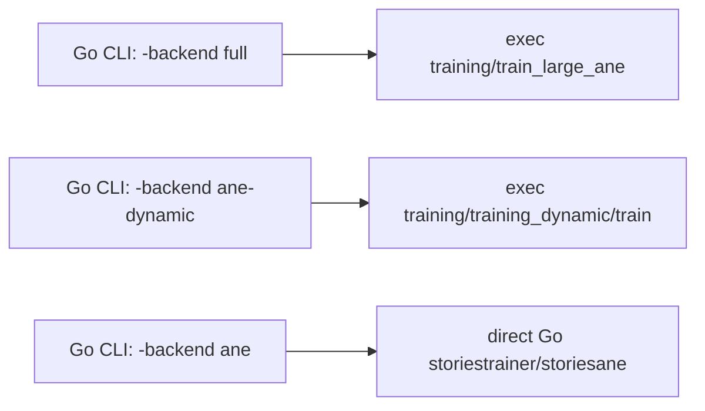
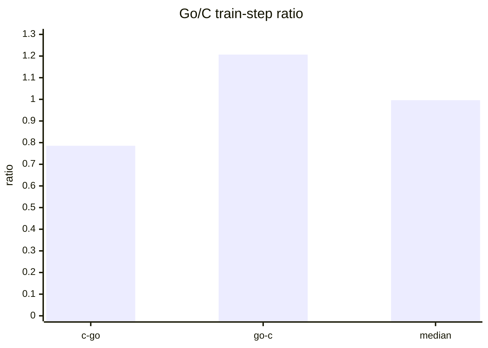

# Go Port Performance

Last updated: 2026-03-09

## Executive Summary

- The strict apples-to-apples comparison in this repository is `C/ObjC: --c-mode ane` versus `Go: --go-backend full`.
- In that strict mode, the Go CLI is a wrapper over the same `train_large_ane` binary, so the meaningful question is wrapper overhead, not model-kernel parity.
- Fresh opposite-order runs on 2026-03-09 land at a median Go/C train-step ratio of `0.996169`, which is effectively parity.
- Single-run ratios ranged from `0.785601` to `1.206736`. That spread is much larger than any plausible wrapper overhead and is dominated by compile/run-order noise.
- `-backend ane-dynamic` is also a wrapper path today.
- `-backend ane` is the real direct-Go path, but for `.bin` models it is not workload-equivalent to `train_large_ane`, so it should not be used for headline parity claims.

## Backend Map



## Measurement Setup

All numbers below were gathered on the same host on 2026-03-09 with:

```bash
GOTMPDIR=/Volumes/tmc/go/src/github.com/maderix/ANE/.tmp/go \
./scripts/compare_c_objc_vs_go_training.sh \
  --c-mode ane \
  --go-backend full \
  --steps 20 \
  --warmup-steps 1 \
  --skip-build \
  --out-dir /tmp/ane_compare_port
```

The compare script's `c-match` profile was active, which means:

- `seq=384`
- `accum=80`
- `veclib_threads=6`
- `dw_concurrency=3`

Artifacts:

- `/tmp/ane_compare_port/summary_20260309_120005.txt`
- `/tmp/ane_compare_port/summary_20260309_120035.txt`

## Current Strict Results

| Run order | C/ObjC avg train ms/step | Go avg train ms/step | Go/C ratio | C compile ms | Go compile ms |
| --- | ---: | ---: | ---: | ---: | ---: |
| `c-go` | 126.4 | 99.3 | 0.785601 | 5495 | 6232 |
| `go-c` | 86.1 | 103.9 | 1.206736 | 47043 | 6600 |
| median take | 106.25 | 101.60 | 0.996169 | n/a | n/a |

The step losses matched in both runs:

- `step 0`: `10.3736`
- `step 10`: `10.3625`

## Charts

```mermaid
xychart-beta
    title "Strict full-path avg train time by run order"
    x-axis ["c-go", "go-c"]
    y-axis "ms/step" 0 --> 140
    bar "C/ObjC train_large_ane" [126.4, 86.1]
    bar "Go CLI backend=full" [99.3, 103.9]
```

```mermaid
xychart-beta
    title "Compile time variability dominated these runs"
    x-axis ["c-go", "go-c"]
    y-axis "ms" 0 --> 50000
    bar "C/ObjC compile ms" [5495, 47043]
    bar "Go compile ms" [6232, 6600]
```







## Interpretation

The current evidence supports one narrow claim:

> The Go `-backend full` wrapper is effectively at parity with the C/ObjC full trainer.

It does **not** support the stronger claim that the direct Go training implementation has matched or exceeded the C/ObjC implementation, because:

- `-backend full` shells out to the C/ObjC full trainer.
- `-backend ane-dynamic` shells out to the C/ObjC dynamic trainer.
- only `-backend ane` is a direct Go execution path, and that `.bin` workload is not strict-parity with `train_large_ane`.

In other words:

- wrapper parity: effectively yes
- direct Go parity with the C/ObjC full topology: not yet demonstrated
- direct Go exceed-C claim: not justified by current data

## Dynamic Path

The dynamic lane should be interpreted the same way as `-backend full`: the Go CLI currently shells out to the C/ObjC dynamic binary, so a Go-vs-C dynamic compare mostly measures wrapper and run-order noise.

The current C/ObjC dynamic baseline from the local `training_dynamic` work is:

- `276.7 ms/step` on a 20-step run dated 2026-03-09

That number is useful as a C/ObjC baseline, but it is not evidence of direct-Go parity because the Go dynamic backend is not an independent implementation.

## Reproduce

Strict parity comparison:

```bash
./scripts/compare_c_objc_vs_go_training.sh --steps 20 --skip-build
./scripts/compare_c_objc_vs_go_training.sh --steps 20 --run-order go-c --skip-build
```

Explicit non-strict research comparison against the direct-Go `.bin` path:

```bash
./scripts/compare_c_objc_vs_go_training.sh \
  --c-mode ane \
  --go-backend ane \
  --allow-mismatch \
  --steps 20 \
  --skip-build
```

Dynamic wrapper comparison:

```bash
./scripts/compare_c_objc_vs_go_training.sh \
  --c-mode ane-dynamic \
  --go-backend ane-dynamic \
  --steps 20 \
  --skip-build
```
